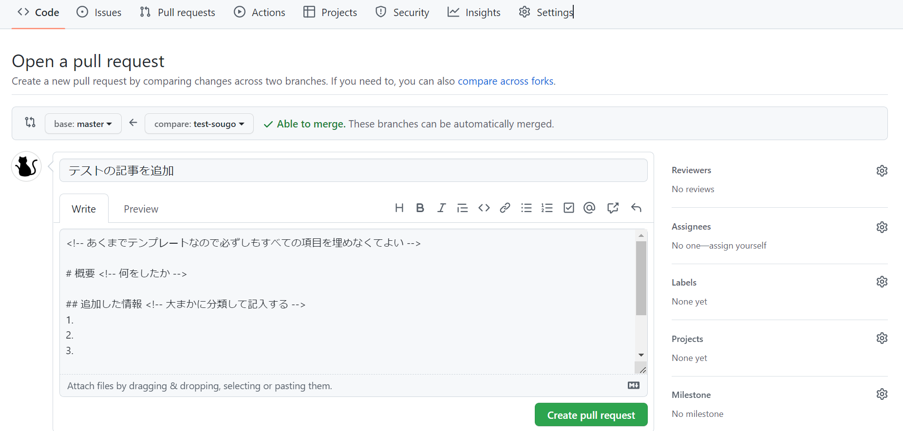
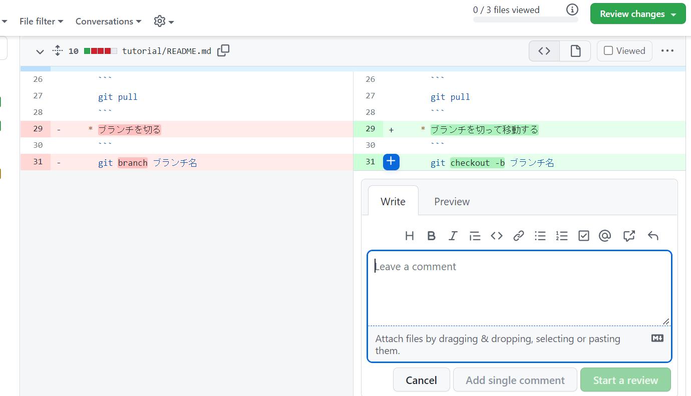
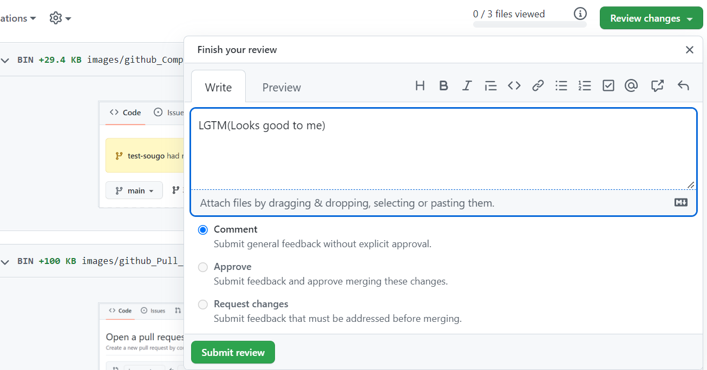

# チュートリアルチャンネル

このチュートリアルは、研修生向けとなっています。<br>
研修生以外の方は、ルールを守ってくだされば、チュートリアルに従わなくても大丈夫です。

## CirKit-TechBoxの使い方
0. WSL上の仮想環境でのgitのsshキーを作成する
  * gitの初期設定
    ```
    git config --global user.name "ユーザー名"
    git config --global user.email "メールアドレス"
    git config --global core.quotepath false #日本語ファイル名がエスケープされないように
    ```
  * .sshファイルに入る
    ```
    cd ~/.ssh
    ```
  * sshキーを作成
    ```
    ssh-keygen -t rsa -C 'メールアドレス'
    #keyを作成するか聞かれるのでEnter
    #パスフレーズを入力
    #パスフレーズを再入力
    ```
  * GitHubに公開鍵を設定する
    生成した公開鍵(rsa.pub)をテキストエディタで開き、中身を全てコピーします。 GitHubにアクセスし、下記の手順通りに公開鍵を登録します。

    1. GitHubにログインし、右上のメニューから Settings を選択
    1. SSH and GPG keys を選択
    1. New SSH Keyを押下
    1. Title(自由)、Key(コピーした内容をペースト)を入力して Add SSH keyを押下 以上でSSH接続の設定が完了です！

1. CirKit-TechBoxをworkspaceの中にクローン
    * ターミナルからUbuntuを開く
      ```
      cd workspace
      git clone git@github.com:cirkit-dev/CirKit-TechBox.git
      ```

2. 記事を書こう
    * mainブランチにいることを確認する
      ```
      git branch
      ```
      上のコマンドを実行したときに* mainと返答されればOK<br>
      (もし違うブランチが返されたら)
      ```
      git checkout main
      ```
    * 最新のリモートリポジトリをpullする
      ```
      git pull
      ```
    * ブランチを切って移動する
      ```
      git checkout -b ブランチ名
      ```
      ブランチ名の命名規則(ブランチ名の付け方)<br>
      ```
      どのチャンネルか-どんな内容か-
      例：Ruby-puts （Rubyのputsコマンドについての記事を書きたい場合）
      ```
    * VScodeを開く
      ```
      code . 
      ```
    * 記事を書くチャンネルのディレクトリを開いてmdファイルを作成する(VScodeを開く前にコマンドで作成しても良い)<br>
    拡張子は.mdにする<br>

    * そのチャンネルのREADME.mdファイルに自分の書いた記事のリンクを記入する。<br>

    * 記事の書き方<br>
    以下のサイトを参考にしてください！<br>
      * [Qiita公式:Markdown記法 チートシート](https://qiita.com/Qiita/items/c686397e4a0f4f11683d)<br>
      * [Qiita マークダウン記法 一覧表・チートシート](https://qiita.com/kamorits/items/6f342da395ad57468ae3)<br>
  
3. 記事をPush(プッシュ)しよう
    ```
    git add .
    git commit -m "コミットメッセージ"
    git push -u origin ブランチ名
    ```
    * コミットメッセージ記入ルール<br>
      ```
      何の記事に何をしたか書く
      例：Rubyのputsについての記事を新しく追加した
      ```

4. Pull requests(プルリクエスト)をたてよう
    * Compare&pull requestsをクリック
    

    * プルリクエストの項目を記入して、Reviewers,Assigness,Labelsを指定して(Create pull request)ボタンを押す
    
      * Reviewers(見て欲しい人)
      * Assigness(作った人)
      * Labels(どの項目か)
    
    * レビュアー選択のルール<br>
  研修中は、自分とその他、同じ研修メンバーを1人以上選択してください。<br>

5. Review(レビュー)をしよう<br>
  他の人が作った記事におかしな点などがないかの確認<br>
  (実際の開発では、他人の書いたコードに修正した方がいい箇所を教えてあげる)<br>
  レビューはGitHub上でもできるが、実際の開発では、pullして確認することが望ましい<br>

  * Pull requestされたブランチをプルする方法
    ```
    git checkout -b 作成したいブランチ名 origin/リモートのブランチ名
    ```
  
  * 研修でのレビューの仕方
    1. 誤字脱字チェック(意外と見逃しがち)
    2. レイアウトチェック(改行や画像が表示されているか)
    3. 内容チェック(明らかに間違ってたり、おかしいものがないか)
  
  * 間違いや気になる箇所があったら、コメントをつけよう<br>(コメントをはプラスをクリックで書き込めるよ)
    
  
  * すべての問題がなかったらApproveしよう<br>
    (Approveする際は、何かしら大丈夫だよってのが分かるコメントを入れてください)
    
  